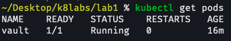

# Установка Docker и Minikube, мой первый манифест

University: [ITMO University](https://itmo.ru/ru/)\
Faculty: [FICT](https://fict.itmo.ru)\
Course: [Introduction to distributed technologies](https://github.com/itmo-ict-faculty/introduction-to-distributed-technologies)\
Year: 2023/2024\
Group: K4111c\
Author: Zhukov Pavel Yurievich\
Lab: Lab1\
Date of create: 08.10.2023\
Date of finished: 12.10.2023

## 0. Введение

###  Цель работы
Ознакомиться с инструментами `Minikube` и `Docker`, развернуть свой первый Pod.

## 1. Запуск minikube
Запустим minikube командой `minikube start`:


Видно, что minikube успешно сконфигурировался под использование Docker, а также сконфигурировал `kubectl` для работы с ним.

## 2. Запуск сервиса

В директории содержится файл `manifest.yaml`, описывающий конфигурацию пода.

Кратко пробежимся по его полям:
* `metadata` содержит информацию, которая позволит явно идентифицировать конкретный под -- его имя, неймспейс, в котором он обитает, а также теги, которыми он помечен
* `spec` описывает конкретное содержимое пода.
  * В секции `containers` описывается информация по каждому контейнеру, входящему в данный под.
  * В нашем случае это один контейнер с именем `vault`, использующим [такой](https://hub.docker.com/_/vault/) image версии 1.13.3, и из этого контейнера необходимо пробросить порт 8200.


Создадим под в нашем кластере через
```
kubectl apply -f manifest.yaml
```

Получаем следующий вывод:


Под создан, но теперь его надо завернуть в сервис с помощью команды
```
kubectl expose pod vault --type=NodePort --port=8200
```


Для получения доступа необходимо прокинуть в новоиспеченный сервис нужный порт.
Сделать это можно с помощью команды
```
kubectl port-forward service/vault 8200:8200
```


Сразу можно ответить на вопрос "что сделали соответствующие команды?":
1. `kubectl apply ...` создает объекты kubernetes согласно описанию в переданном файле, URL или из stdin.
2. `kubectl expose ...` создает новый сервис из указанного объекта по названию.
Тип NodePort позволяет открыть сервиса на указанном порту, что позволит подключаться к нему "извне".
3. `kubectl port-forward LOCAL_PORT:REMOTE_PORT` включает проброс портов к поду.
Все подключения к `localhost:LOCAL_PORT` в нашем случае будут проброшены к поду, который "сидит" на порту `REMOTE_PORT`.

После исполнения этих команд в под можно зайти по адресу [http://localhost:8200](http://localhost:8200).

Эта ссылка приведет нас на следующую страницу:


Для логина в Vault необходимо найти токен.
Рассмотрим способ его получения в следующем пункте.

## 3. Получение токена

Известно, что Root токен находится в логах пода `vault`.
Посмотрим на список подов с помощью `kubectl get pods`:\


Логи конкретного пода можно получить с помощью
`kubectl logs <название пода>`

Конкретный токен можно получить либо через монотонное чтение всего лога глазами, либо с помощью `grep`.

Выполним
```
kubectl logs vault | grep "Root Token"
```


С этим токеном можно смело идти в Vault и авторизоваться с ним.


## 4. Схема

